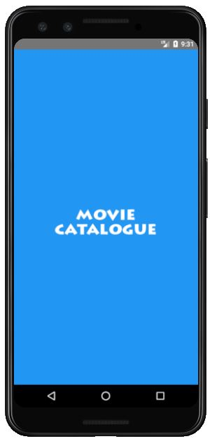
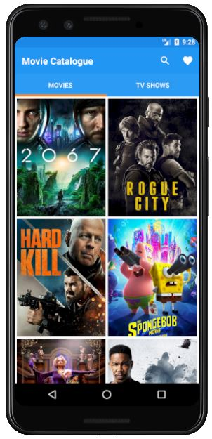
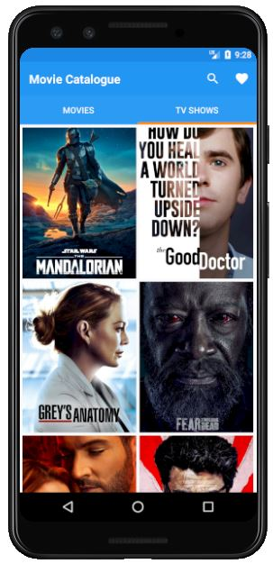
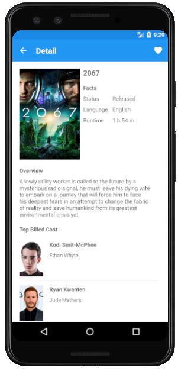
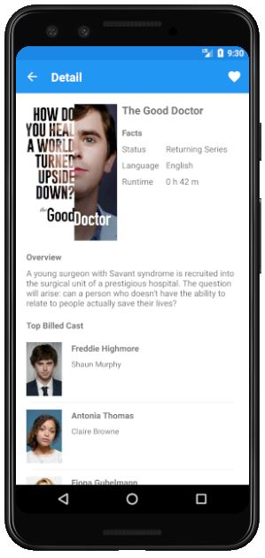
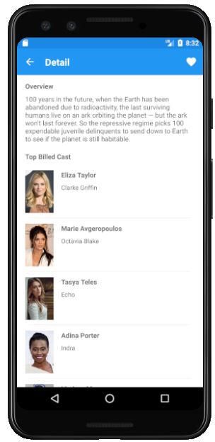

# Movie-Catalogue
## About This App
This app was created when I took the Android Jetpack Pro course to implement ViewModel, Splash Screen, Repository Pattern, LiveData, Idling Resources, Unit Testing, and Instrumentation Testing.
This app displays a list of Film (Movie and TvShow) along with their details. The data displayed is obtained via the [MovieDb API](https://developers.themoviedb.org/3/getting-started/introduction) data.

App features:
-	Movie List
-	Tv Show List
-	Movie Details
-	Tv Show Details

## Project Status
On Progress

Further features:
-	Favorite Film
-	Film Searching
-	Film Filtering

Further implementation of Android component and concept:
-	Room
-	Pagination

## Preview
To see a preview of this app, you can download the app installer [here](https://drive.google.com/file/d/1nD7IyFZuIV6QCF5D52_u1sp5jRGvo1zp/view?usp=sharing) and then install it on your Android phone. Or you can watch the preview video [here](https://drive.google.com/file/d/1V_YWvKaMlsa22HV3AtWIx5c0gnzo09mx/view?usp=sharing).

## Screenshots
|Splash Screen|Movie List|Tv Show List|
|-------------|----------|------------|
|||

|Movie Details|Tv Show Details|Tv Show Details|
|-------------|----------|------------|
|||

## Language
Kotlin

## Architectural Pattern
MVVM (Main - View - ViewModel)

## Additional Libraries
- lifecycle
- recyclerview
- fast android networking
- glide
- espresso
- mockito
